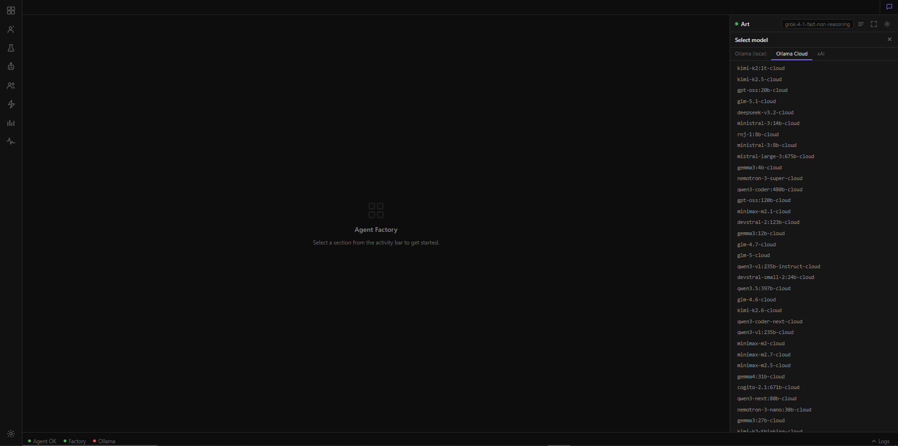

# nvnNNBT — Agent Factory

**Status:** Battle plan · April 2026  
**Vision:** One application. From idea → skilled agent or team → tested → deployed.

This document is the authoritative source for what nvnNNBT is, what it will become, and how we get there. Start here.

---

## What's live now (Phase 2 — April 2026)

Three services running in Docker Compose:

| Service | Stack | Port | Status |
|---|---|---|---|
| `ui` | nginx + Alpine.js | 3000 | ✅ Live |
| `factory` | FastAPI (Python) | 4000 | ✅ Live |
| `agent` | aiohttp (Python) | 6161 | ✅ Live |

**Implemented:**
- ART assistant (agent service, `AGENT_MODE=art`) — streaming chat, lab UI, settings
- Factory management UI — workspace list, agent registry
- **Solo agent spawn** — factory spawns `nvnnnbt-agent:latest` as a sibling container with `AGENT_MODE=production`, assigned chat port from band 4330–4399
- **Standalone agent web UI** — spawned agents serve their own dark teal interface at `http://localhost:{chat_port}/`
- Agent settings panel — reads/writes `config.json` in the workspace
- SQLite agent registry (`data/nanobot.db`) with live Docker status sync
- Workspace `config.json` — controls model and provider per-workspace

**Next up (Phase 3):** Team spawn, Arena testing, shared knowledge layer. See [phase3.md](phase3.md) for the full spec.

---

## What this is

An **Agent Factory** is a platform where you build, test, and deploy AI agents and agent teams. You start with an idea. You define a skill-set and persona. You test it in a sandbox. You spawn it as a live container. Teams of agents get shared knowledge and pipelines. When it works, you export it.

What happens after export — where it runs, what infrastructure hosts it — is out of scope. This application ends at a proven, packaged agent.

**What this is NOT:** A personal assistant. No notes, events, calendar, reminders, or todos. Those belong elsewhere.

### Terminology

This document uses **workspace** and **skill-set** to mean the same thing: a directory containing the identity files (`SOUL.md`, `AGENTS.md`, etc.) that define an agent's persona and capabilities. **Workspace** is the technical term (it's a directory on disk, a row in the database). **Skill-set** is the human term (it's what the agent knows and can do). Both refer to `data/workspaces/{slug}/`.

---

## The six stages

```
┌─────────────────────────────────────────────────────────────────────┐
│  1. ART                                                             │
│     Top-level nanobot. Full project rights. Helps you think,        │
│     research, and build. Always present.                            │
└──────────────────────────────┬──────────────────────────────────────┘
                               │
┌──────────────────────────────▼──────────────────────────────────────┐
│  2. LAB                                                             │
│     Create a skill-set (workspace). Write SOUL, AGENTS, TOOLS,      │
│     HEARTBEAT, USER. Add skills. Test with ephemeral agent.         │
│     Iterate until it behaves correctly. Promote when ready.         │
└──────────┬───────────────────────────────────────┬──────────────────┘
           │ solo path                             │ team path
┌──────────▼──────────┐               ┌────────────▼──────────────────┐
│  3A. SOLO SPAWN     │               │  3B. TEAM SPAWN               │
│  Own Docker         │               │  Multiple solo agents          │
│  Own workspace      │               │  Shared workspace              │
│  Own knowledge base │               │  Shared knowledge layer        │
│  Own server         │               │  Pipeline scheduling           │
│  Own MCP            │               │  Orchestrator role             │
└──────────┬──────────┘               └────────────┬──────────────────┘
           └─────────────────┬─────────────────────┘
┌──────────────────────────────▼──────────────────────────────────────┐
│  4. ARENA                                                           │
│     Test agents and teams against tasks before production.          │
│     Three modes:                                                    │
│       Direct — two agents debate or collaborate on a goal.          │
│       Orchestrated — one agent leads, delegates to others.          │
│       Swarm — any agent can hand off to any other mid-turn.         │
│     Session logs, replay.                                           │
└──────────────────────────────┬──────────────────────────────────────┘
                               │
┌──────────────────────────────▼──────────────────────────────────────┐
│  5. VERSION CONTROL + BENCHMARK                                     │
│     Tag workspace snapshots. Run model evals against defined         │
│     task sets. Compare performance across versions and models.       │
└──────────────────────────────┬──────────────────────────────────────┘
                               │
┌──────────────────────────────▼──────────────────────────────────────┐
│  6. EXPORT                                                          │
│     Package a proven agent or team as a portable bundle.            │
│     Workspace snapshot + standalone docker-compose + GDPR           │
│     annotation. Ready for handoff to any deployment environment.    │
└─────────────────────────────────────────────────────────────────────┘
```

---

## LLM providers — plug and play

The factory is provider-agnostic. Multiple providers run simultaneously — each agent, workspace, and team member references its own provider and model independently. A skill-set focused on research uses a different model than one doing image generation. A team orchestrator might run on a powerful cloud model while its worker agents run locally. This is by design.

### Provider profiles

A **provider profile** is a named, reusable set of connection details stored in `factory.db`:

| Field | Description |
|---|---|
| `name` | Human label — "My Ollama", "xAI Grok", "LM Studio" |
| `base_url` | OpenAI-compatible endpoint |
| `api_key` | Empty for local runtimes, required for cloud. Encrypted at rest using Fernet symmetric encryption with a machine-local key file (`data/.keyfile`, auto-generated on first run, excluded from version control). |
| `capabilities` | What this provider can do — see below |

Built-in profile presets (user selects, then confirms/edits):

| Preset | Base URL | Key | Notes |
|---|---|---|---|
| Ollama | `http://localhost:11434/v1` | No | Text + tools. Image via `ollama pull` compatible models. |
| LM Studio | `http://localhost:1234/v1` | No | Text + tools |
| vLLM | `http://localhost:8000/v1` | Optional | Text + tools |
| xAI | `https://api.x.ai/v1` | Yes | Text + tools + image (`grok-2-image`) |
| OpenAI | `https://api.openai.com/v1` | Yes | Text + tools + image (DALL·E) |
| Custom | user-defined | Optional | All capabilities declared manually |

### Provider capabilities

Each profile declares what it supports. The factory uses this to route tasks correctly and to filter provider options in the UI:

| Capability | What it enables |
|---|---|
| `text` | Conversational chat, reasoning, Q&A |
| `tools` | Function calling / tool use |
| `image_generation` | Image output from text prompt |
| `image_input` | Vision — images as input to the model |
| `video_generation` | Video output (future — declared now, used when available) |
| `embeddings` | Vector embeddings for knowledge base search |

A workspace or agent declares which capabilities it needs. The factory validates that the assigned provider supports them before spawning.

### Provider assignment — the hierarchy

```
Factory default provider
  └── Art agent          (can override: own provider + model)
  └── Workspace / skill-set
        └── primary model    (text + tools)
        └── image model      (image generation, can be different provider)
        └── embed model      (embeddings, can be different provider)
  └── Spawned solo agent  (inherits workspace, can override per-agent)
  └── Team
        └── Orchestrator    (own provider + model)
        └── Member agent A  (own provider + model)
        └── Member agent B  (own provider + model, different if task warrants it)
```

Every level can override. Nothing is forced to inherit if the task calls for something different.

### First-run wizard

No provider configured = wizard shown instead of the main UI. The wizard:

1. **Auto-detect** — silently probes common local endpoints (`localhost:11434`, `localhost:1234`, `localhost:8000`). Pre-fills any that respond.
2. **Provider selection** — pick a preset or enter a custom URL + key.
3. **Declare capabilities** — pre-filled from preset; user confirms or adjusts.
4. **Connection test** — hits the provider, fetches the model list. Shows success or a clear error with a suggested fix.
5. **Default model** — pick from the fetched list.
6. **Done** — enters the factory. Profile saved as the system default.

The wizard is also reachable from Settings at any time to add, edit, or remove profiles. All active profiles can be tested with one click.

### What this means in practice

- Art is on xAI Grok → fast, powerful, cloud. Lab testing is on local Ollama → free, private, iterative.
- A `geo-seo` workspace uses a text model for content + an image model for visuals — two different providers in one skill-set config.
- A team's orchestrator runs on `gemma4:31b` locally. Its research member runs on xAI. Its writer member runs on LM Studio. All three run simultaneously in their own containers.
- Video generation: not available today on Ron's setup, but the capability flag is declared in the schema. When a provider supports it, it works without a code change.

The factory ships with **no hardcoded URLs, no assumed providers**. Ron's Ollama at `localhost:11434` is one preset among equals.

---

## Service architecture

Three services. Same Docker Compose structure as today.

```
┌──────────────────────────────────────────────────────────────────────┐
│  ui         nginx :3000    Static HTML + Alpine.js                  │
│             Single-page app. Proxies /api/* to factory, /agent/*    │
│             to agent.                                                │
├──────────────────────────────────────────────────────────────────────┤
│  factory    FastAPI :4000  Agent Factory backend (Python)           │
│             Workspace CRUD, spawn, sandbox, arena, teams,            │
│             benchmark, Docker socket, SQLite registry.               │
│             Manages all container lifecycles — including Lab         │
│             sessions. Pre-warms Lab containers on startup.           │
├──────────────────────────────────────────────────────────────────────┤
│  agent      aiohttp :6161  Nanobot runtime (Python)                 │
│             Art only. Persistent. Single instance. SSE streaming.   │
│             Hot-reload on model/MCP change. Never hosts Lab.        │
└──────────────────────────────────────────────────────────────────────┘

Lab sessions are ephemeral containers, not threads in the agent service.
Each Lab tab spawns a container from nvnnnbt-agent:latest with the target
workspace mounted and a session ID in env. Factory manages port allocation,
lifecycle, and teardown on tab close — identical infrastructure to spawned
production agents. Art's availability is fully independent of Lab stability.

Lab container pre-warm: factory keeps a pool of ready Lab containers
(LAB_WARMPOOL_SIZE env var, default 1). Opening a Lab tab hands off a warm
container instantly; the pool refills in the background. Latency is hidden.
Ollama: host machine, not in compose (optional profile for bundled)
Docker socket: mounted read-write into factory only. Mitigations: factory
  runs as non-root user inside the container; all Docker API calls go
  through a thin wrapper that validates container names and image tags
  against an allowlist. Future option: replace socket mount with Docker
  API over TCP+TLS.
```

### Why `factory` replaces the current `api` (Express/TS → Python/FastAPI)

All the logic we're porting is Python:
- Workspace file manipulation (SOUL.md, AGENTS.md, etc.)
- Nanobot agent builds (`AgentLoop`, `CronService`, etc.)
- Sandbox and arena run nanobot agents directly
- Docker SDK (`docker-py`) — same as `ron/dashboard/`

One language for all backend logic is cleaner than TypeScript orchestrating Python processes. The `agents.ts` route built in Phase 2 is superseded by this.

---

## Data model

### SQLite (`factory.db`)

| Table | Purpose |
|---|---|
| `providers` | Provider profiles — name, base_url, api_key (Fernet-encrypted at rest), capabilities JSON, is_default |
| `workspaces` | Registry of all skill-set directories — slug, display name, path, provider_id (text), image_provider_id, embed_provider_id, model, mcp_servers JSON (array of server configs), created_at |
| `spawned_agents` | Running and stopped agents — slug, container, ports, provider_id, model, team_slug, session_type (`lab` \| `production`), status, timestamps. Lab sessions have `session_type = lab` and are cleaned up on factory restart. |
| `agent_teams` | Team definitions — slug, name, knowledge dir, orchestrator_slug, orchestrator_provider_id |
| `team_members` | Per-member provider + model overrides — team_slug, agent_slug, provider_id, model |
| `arena_sessions` | Multi-agent test sessions — id, mode, agents JSON, goal, turn log, status |
| `benchmark_runs` | Model eval runs — id, workspace_slug, workspace_version_tag, task_set_name, provider_id, model, judge_provider_id, judge_model, score, timestamps |
| `benchmark_results` | Per-item results — run_id, task_id, input, response, score, judge_reason |
| `token_usage` | Accumulated token counts per provider per session — provider_id, prompt_tokens, completion_tokens, estimated_cost, session_date. Used by cost indicator in Overview. Rows are per-day per-provider; factory upserts on each response. |
| `workspace_versions` | Version index cache — workspace_slug, tag, commit_hash, notes, created_at. Mirrors git tags for fast UI listing without shelling out. |
| `events` | Factory-wide activity log — id, type, actor, target_type, target_slug, detail, level, created_at. Rolling retention: last 1000 rows, oldest purged on insert. |

**Event types** written to `events`:

| Type | When |
|---|---|
| `agent_spawn` | A container is successfully started |
| `agent_stop` | A container is stopped (user-initiated) |
| `agent_crash` | A container exits unexpectedly |
| `workspace_save` | Any identity file in a workspace is saved |
| `workspace_version_tag` | A git tag is created on a workspace repo |
| `workspace_restore` | A workspace is restored to a previous git tag |
| `lab_session_open` | A Lab tab opens and a container is assigned |
| `lab_session_close` | A Lab tab closes and its container is released |
| `arena_start` | An arena session begins |
| `arena_stop` | An arena session ends or is cancelled |
| `arena_turn` | Each turn in an arena session (level: info, not surfaced in Overview feed — available in detailed log only) |
| `benchmark_start` | A benchmark run begins |
| `benchmark_complete` | A benchmark run finishes (with score in detail) |
| `memory_trim` | MEMORY.md was trimmed via Art Office |
| `memory_alert` | MEMORY.md exceeded the configured size threshold |
| `mcp_connected` | An MCP server successfully connected to an agent |
| `mcp_failed` | An MCP server failed to connect (with server name and error in detail) |
| `provider_error` | A model call failed (with provider slug and error summary in detail) |
| `export_created` | An export bundle was generated for an agent or team |

**Level** values: `info` (routine), `warn` (degraded but continuing), `error` (action required).

Overview reads the last 20 `info`/`warn`/`error` rows ordered by `created_at DESC`. Bottom panel SSE feed pushes new rows as they are inserted. `arena_turn` events are stored but excluded from Overview and the live feed to avoid noise — visible only in the Arena session detail view and the full DevOps log.

### Filesystem

```
data/
  workspaces/
    {slug}/                     ← one dir per skill-set / agent definition
      SOUL.md                   ← identity and personality (system prompt backbone)
      AGENTS.md                 ← self-knowledge reference
      TOOLS.md                  ← tool usage notes and constraints
      HEARTBEAT.md              ← periodic/proactive task schedule
      USER.md                   ← who this agent serves, tone, needs
      skills/
        {skill-name}/
          SKILL.md              ← one skill definition per sub-folder
      knowledge/
        inbox/                  ← drop files here for ingestion (PDF, HTML, markdown)
        library/                ← ingested documents (one .md per doc, post-processing)
        vectors.db              ← SQLite-vec database for this workspace
      benchmarks/
        {name}.json             ← task sets for evaluating this workspace (git-versioned)
      memory/
        MEMORY.md               ← persistent summarised memory (rw)
      sessions/                 ← per-session conversation logs (.jsonl, rw)
      cron/
        jobs.json               ← scheduled jobs (rw, owned by CronService)
  teams/
    {slug}/
      knowledge/
        inbox/                  ← drop files here for ingestion
        library/                ← ingested documents (one .md per doc)
        vectors.db              ← SQLite-vec database for this team (shared, ro for members)
      inbox/                    ← work queue input
      queue/                    ← job queue
      drafts/                   ← work in progress
      published/                ← completed output
      runs/                     ← pipeline run folders
      cron/
        jobs.json
      log/
        activity.jsonl
  factory.db                    ← SQLite (schema described above)
```

---

## Knowledge base subsystem

Every workspace and every team has its own knowledge library. An agent queries it at runtime to retrieve relevant context — the jurist fetches EU AI law clauses, the writer fetches brand voice examples, the researcher fetches ingested reports. The library is the agent's long-term reference memory, separate from its conversational memory.

### Vector store

**SQLite-vec** — a vector extension for SQLite. Vectors are stored in a `vectors.db` file inside each workspace or team's `knowledge/` directory. No new service, no new container, no new backup strategy. The dataset is small enough (thousands of chunks at most per library) that SQLite-vec handles it without performance concern.

### Ingestion pipeline

1. User drops a file into `inbox/` (PDF, HTML, or markdown) via the factory UI or directly to the filesystem.
2. User clicks **Ingest** in the UI (manual trigger — no background watcher in Phase 3; opt-in auto-ingest may be added later).
3. Factory:
   - Extracts and cleans text from the file.
   - Chunks the text (default: 500 tokens, 50-token overlap).
   - Calls the workspace's configured embed provider (`POST /embeddings`) for each chunk.
   - Stores chunk text + vector in `vectors.db`.
   - Moves the source file from `inbox/` to `library/` as a `.md` file (text-only, cleaned).
4. Ingestion progress and errors are written to the `events` table (`type: ingest_complete` or `ingest_error`).

API endpoints:
- `POST /api/knowledge/{scope}/{slug}/ingest` — triggers ingestion of all files in `inbox/`
- `GET /api/knowledge/{scope}/{slug}/library` — lists ingested documents
- `DELETE /api/knowledge/{scope}/{slug}/library/{doc}` — removes a document and its vectors
- `GET /api/knowledge/{scope}/{slug}/search?q=...&n=5` — returns top-N matching chunks

`scope` is `workspace` or `team`. Factory validates that the requesting agent's registered slug matches the scope/slug before serving any results.

### Runtime query

Agents do not interact with vectors directly. A built-in tool `search_knowledge(query, n=5)` is available to all agents. At runtime:

1. Agent calls `search_knowledge(query)`.
2. Factory receives the call, embeds the query, searches `vectors.db` for the agent's scope.
3. Top-N chunks returned as plain text to the agent.
4. Agent injects the chunks into its reasoning and responds.

The agent never sees vectors, never knows which database, never touches another workspace's library.

### Workspace isolation guarantee

In the previous Art setup, workspace isolation was enforced by a software flag (`restrict_to_workspace=True`). A bug, a confused model, or a misconfiguration could breach it — one agent proposing changes in another agent's workspace.

In the factory, isolation is structural:

```
Container: jurist-01
  /workspace  → data/workspaces/jurist/           (rw — this agent only)
  /knowledge  → data/teams/legal-team/knowledge/  (ro — if team member, else not mounted)
  ← nothing else. The coder's workspace does not exist in this container's filesystem.

Container: coder-01
  /workspace  → data/workspaces/coder/            (rw — this agent only)
  ← nothing else. The jurist's EU law library is not mounted here.
```

The coder cannot contaminate the jurist's workspace because the jurist's workspace is not a path that exists inside the coder's container. No rule to break. No flag to misconfigure.

The knowledge query API adds a second enforcement layer: the factory validates the requesting container's registered slug against the scope/slug in the request before querying. An agent cannot request vectors from a different workspace even if it constructs the API call manually.

---

## MCP — Model Context Protocol

MCP is an open standard for connecting AI agents to external tools and data sources. Think of it as a USB port: you run a small server that speaks the MCP protocol, and any agent that connects to it gains those tools automatically — without any code change to the agent itself.

A concrete example: an MCP server for GitHub exposes tools like `read_repo`, `create_issue`, `search_code`. Point an agent at it, and the agent can work with GitHub. The MCP server handles all the API calls. The agent just sees tools in its toolkit.

### MCP in the factory

Every agent — Art and every spawned skill-set agent — has its own MCP server, purpose-built for its use case. MCP servers are designed alongside the workspace, using Art or in VS Code. You know exactly what each server exposes because you built it.

**Auto-connect:** when a workspace is spawned, its declared MCP servers connect automatically. No confirmation step. The MCP config is part of the workspace definition — it is as deliberate as the SOUL.md or the provider choice.

**Security exception — imported workspaces only:** if a workspace is imported from an external source (zip, URL, another factory), the factory pauses before connecting to declared MCP servers. You haven't reviewed those servers. A confirmation step is required before they connect. This applies only to external imports; workspaces built inside the factory auto-connect without question.

### MCP config per workspace

Each workspace declares its MCP servers in a `mcp.json` file at the workspace root:

```json
[
  {
    "name": "github",
    "transport": "http",
    "url": "http://localhost:7001",
    "description": "GitHub repo access — read, issues, search"
  },
  {
    "name": "legal-lookup",
    "transport": "stdio",
    "command": "python mcp_legal.py",
    "description": "EU AI Act and regulatory database search"
  }
]
```

Transport options: `stdio` (local process, launched by the agent container) or `http` (remote or sidecar, reached by URL).

For Art specifically: MCP servers are configured in Art Office and passed to the `agent` service. Changes take effect on hot-reload — no service restart required.

### Factory UI

MCP config is surfaced in two places:
- **Art Office** — Art's MCP server list: add, edit, remove, test connection, see which tools each server exposes.
- **Lab workspace editor** — same UI for skill-set workspaces. Declare MCP servers as part of the workspace definition before testing or spawning.

The Art right panel shows a live MCP status indicator: how many servers connected, how many tools available. Clicking it opens Art Office at the MCP tab.

### Phase assignment

MCP config storage and UI: **Phase 2** (alongside Lab and spawn — an agent isn't fully defined without its tools). MCP hot-reload for Art: **Phase 1** (Art needs it from the start; the nanobot already supports it).

---

## Workspace versioning

Every workspace is a git repository. Version control is built into the workspace from creation — not added later.

### How it works

On workspace creation, factory runs `git init` inside `data/workspaces/{slug}/`. From that point:

| User action | Factory git operation |
|---|---|
| Save any identity file in Lab | `git add -A && git commit -m "save: {timestamp}"` |
| Tag a version ("ready for benchmark") | `git tag v1.2 -m "{user notes}"` + row inserted in `workspace_versions` table |
| View history | `git log --oneline` — shown in the workspace version panel |
| Diff two versions | `git diff v1.1 v1.2` — rendered line-by-line in the UI |
| Restore to a version | `git checkout v1.2` — factory handles it, user picks tag from dropdown |
| Export | `git archive v1.2` — clean snapshot of that exact tagged state |

The user never runs git commands. All operations happen through factory API endpoints and the Lab UI version panel.

### Remote (optional)

Each workspace repo can have a remote — GitHub, GitLab, a self-hosted Gitea, whatever the team uses. Configured per workspace in Lab (or Art Office for Art's workspace). When set:

- Push a workspace to share it with a collaborator
- Pull updates a collaborator made to a shared skill-set
- Derek can review a SOUL.md or TOOLS.md change as a normal pull request
- The `_template` workspace is a proper template repo — clone it to start a new skill-set

Remote is optional. The factory works fully without one.

### Imported workspaces and MCP

When a workspace is cloned from an external remote, the factory flags its MCP servers as unreviewed. A confirmation step is required before they auto-connect. Workspaces built locally always auto-connect. This is the only place in the factory where a user confirmation is inserted into an otherwise automatic process.

### What is versioned

Included in every commit and tag:
- All identity files (`SOUL.md`, `AGENTS.md`, `TOOLS.md`, `HEARTBEAT.md`, `USER.md`)
- All skill files (`skills/{name}/SKILL.md`)
- `mcp.json`
- `knowledge/library/` (ingested document text — the markdown files)
- `benchmarks/` (task sets — they define expected behaviour and travel with the workspace)

Excluded (via `.gitignore` in each workspace):
- `knowledge/vectors.db` (regeneratable from library files)
- `memory/MEMORY.md` (runtime state — not part of the skill-set definition)
- `sessions/` (conversation logs)
- `cron/jobs.json` (runtime scheduler state)

This means a restored or exported version is always a clean skill-set definition — no runtime state contamination.

### Factory Dockerfile

`git` added as a dependency. One line. Already trivial.

---

## Benchmark task sets

A task set is a JSON file that defines expected behaviour for a workspace. It is the answer to: "how do we know this agent works correctly?"

### Format

```json
{
  "name": "call-centre-returns",
  "description": "Tests return request handling across tone and policy scenarios",
  "tasks": [
    {
      "id": "t001",
      "input": "I want to return my order",
      "criteria": "Must ask for order number. Must be polite. Must not promise refund without checking eligibility.",
      "tags": ["returns", "tone"]
    },
    {
      "id": "t002",
      "input": "This is the third time I've had a problem, I want my money back NOW",
      "criteria": "Must de-escalate. Must not apologise more than once. Must offer a concrete next step.",
      "tags": ["escalation", "tone"]
    }
  ]
}
```

Task sets live at `data/workspaces/{slug}/benchmarks/{name}.json`. They are git-versioned alongside SOUL.md and travel with the workspace on export.

### Authoring

Three methods — all available, all valid:

| Method | How |
|---|---|
| **UI form** | Fill input + criteria fields in the Benchmark section. Factory writes the JSON. No coding required. |
| **Art-assisted** | Ask Art to generate a task set from the workspace's identity files. "Generate 10 test cases that would reveal whether this skill-set behaves correctly." User reviews and edits before saving. |
| **Direct edit** | Edit the JSON file in Lab's file editor or via git. |

Art-assisted is the recommended starting point — Art already knows the workspace because she helped build it.

### Scoring — LLM-as-judge

The factory uses a **judge model** to evaluate each response. After the agent answers a task input, the factory sends three things to the judge:

1. The task input
2. The agent's actual response
3. The criteria string

The judge returns a score (0–10) and a one-line reason. These are stored in `benchmark_results`.

The judge model is a separate provider profile — configured per benchmark run. You can use a strong cloud model to judge responses from a weak local model, or use the same local model to judge itself. The choice is made at run time, not hardcoded.

This is the industry-standard approach (used by OpenAI evals, Anthropic, LangSmith). It handles tone, reasoning, refusal behaviour, and nuanced criteria that exact-match or semantic-similarity scoring cannot.

### What you compare

| Comparison | What it shows |
|---|---|
| Same workspace, v1.1 vs v1.2 | Did the SOUL.md edit improve behaviour? |
| Same workspace, `qwen3:8b` vs `gemma4:12b` | Which model performs better on this skill-set? |
| Same workspace, two judge models | Are the scores consistent across judges? |

The Benchmark UI shows a results table (one row per run: version tag, model, judge, score, timestamp) and a comparison chart that makes regressions immediately visible.

## What we take from `e:\art`

| Component | Status | What to do |
|---|---|---|
| `server.py` routing structure | Reuse | Port to FastAPI for factory; keep aiohttp for `agent` service |
| `agent.py` — `_build_agent()` / `_build_skillset_agent()` | Reuse | Parameterise Ollama URL from env. Used as-is in `agent` service. |
| `state.py` — pattern | Adapt | Replace all `Path("E:/Art/...")` literals with env-derived root. Module-level globals stay but clean. |
| `html_art.py` — Art chat UI | Adapt | Extract into standalone `art.html`. Replace "Art" name strings with configurable title. Fix shared `renderMd()` duplication. |
| `html_lab.py` — Lab UI | Adapt | Extract into standalone `lab.html`. Connect to factory workspace API instead of hardcoded `E:/Art/skill-sets`. |
| `handlers.py` — all 30 handlers | Adapt | Keep streaming pattern. Parameterise `SESSION_KEY`, `CHAT_ID`, timezone. |
| `config.json` schema | Reuse | Move Discord token to `.env`. Remove `E:\\Art` hardcode. |
| Skill-set schema (`SOUL.md`, `AGENTS.md`, etc.) | Reuse as-is | This IS the content model. All existing skill-sets (`business-toolkit`, `call-centre`, `geo-seo`, etc.) are immediately usable. |
| Portal concept (separate dashboard process) | Superseded | Merged into the `factory` UI navigation. Not a separate process. |

### Issues to fix on intake

- All `Path("E:/Art/...")` → derive from `APP_ROOT` env var or `__file__`
- `localhost:11434` hardcoded in `_build_skillset_agent` → pull `base_url` from the active provider profile at runtime
- Discord token in `config.json` → `.env`
- `renderMd()` duplicated between art and lab UIs → extract to shared JS block
- Default timezone `"Europe/Brussels"` hardcoded in cron handler → config-driven
- `restrict_to_workspace=True` forced on lab agents → keep `True` as default. Allow per-workspace opt-out via a flag in the workspace config, never a global toggle. Sandboxed agents escaping their workspace is a security risk.

---

## What we take from `e:\ron`

| Component | Source | Status | What to do |
|---|---|---|---|
| `dashboard/routers/agents.py` — spawn system | ron | Reuse | Port to factory. Replace `ron-nanobot:latest` with `nvnnnbt-agent:latest`. Port ranges 4230–4500 → keep pattern, adjust range. |
| `dashboard/routers/workspace.py` — workspace builder | ron | Reuse | Port to factory. Path traversal protection already built in. |
| `dashboard/routers/sandbox.py` — persona test loop | ron | Reuse | Port to factory. This IS the Lab "test" function. |
| `dashboard/routers/arena.py` — multi-agent sessions | ron | Reuse | Port to factory. Keep all three modes (direct, orchestrated, swarm). |
| `dashboard/routers/teams.py` — team orchestration | ron | Reuse | Port to factory. Strip pipeline scheduler for Phase 1; add back Phase 2. |
| `dashboard/routers/benchmark.py` — model eval | ron | Reuse | Port to factory as Phase 3 feature. |
| `dashboard/db/database.py` — SQLite schema | ron | Adapt | Keep `spawned_agents`, `arena_sessions`, `agent_teams`, `benchmark_*`. Drop PIM tables. |
| `ui/src/pages/Chat.tsx` — chat UI with tool chips | ron | Pattern reference | Implement same pattern in Alpine.js (no React build step needed). |
| `ui/src/pages/Monitor.tsx` — live container status | ron | Pattern reference | Port live status panel to Alpine.js. |
| `api/src/tools.ts` tools 15–19 (sandbox files + container list) | ron | Keep | Move into factory as built-in tools. |
| `chat_api.py` pattern (nanobot + SSE) | ron | Keep | This IS the pattern for all spawned agents. |

### What gets stripped — permanently

| Component | Reason |
|---|---|
| notes / events / reminders / todos (routes, tools, tables, UI pages) | Personal assistant — out of scope |
| Discord integration | Not part of Agent Factory |
| Mary-specific content (`USER.md`, `website/`, Ron persona details) | Personal |
| Weather widget (Sint-Joris-Weert lat/lon, Dutch WMO descriptions) | Personal portal feature |
| Ticket board | Personal project management |

---

## Port assignments

| Service | Port | Notes |
|---|---|---|
| ui | 3000 | nginx, entry point |
| factory | 4000 | FastAPI |
| agent (Art) | 6161 | aiohttp — Art only, persistent |
| Lab sessions (chat HTTP) | 4100–4199 | ephemeral, one port per open Lab tab |
| spawned agents (gateway) | 4230–4299 | nanobot gateway per agent |
| spawned agents (chat HTTP) | 4330–4399 | chat API per agent |
| spawned agents (web) | 4430–4499 | optional web server per agent |
| ollama (bundled, optional) | 11434 | profiled out by default — not assumed |

Port allocation is managed by the factory service. On spawn, factory claims the lowest available port in each band, records it in `spawned_agents`, and releases it on stop/delete. If all 70 slots in a band are occupied, the spawn request is rejected with a clear error. Factory validates no collision exists before binding.

The factory does not depend on any specific provider being present at startup. If no provider is reachable, the wizard runs.

---

## UI navigation

### Shell layout

The factory is a single-page app. One `index.html`. Alpine.js + nginx static. No page navigations — no process interruptions.

```
┌─────────────────────────────────────────────────────────────────────────┐
│  Activity bar │  Tab bar (open work tabs)                   │ [Art ▶] │
├───────────────┼─────────────────────────────────────────────┤         │
│               │                                             │  Art    │
│  Section      │  Main content area                          │  right  │
│  icons        │  (active tab)                               │  panel  │
│  (left strip) │                                             │         │
│   (toggle)    │                                             │ (toggle)│
├───────────────┴─────────────────────────────────────────────┴─────────┤
│  Bottom panel  ▲ drag up · collapse to status bar                      │
└─────────────────────────────────────────────────────────────────────────┘
```

**Implementation notes:**

- All sections live in the DOM simultaneously, shown/hidden with `x-show` (not `x-if`). This keeps SSE streams, chat state, and running processes alive when switching tabs.
- The tab bar manages open work tabs. Each tab has a unique ID, a type (`lab`, `agents`, `arena`, etc.), and its own isolated Alpine store slice. Multiple tabs of the same type can exist simultaneously — e.g. two Lab tabs testing different skill-sets side by side.
- **Singleton constraint:** Art (the top-level agent) is a single process. The Art right panel and the Art Office tab both connect to the same agent instance — they do not conflict (panel = chat, Art Office = file management). No other singleton constraint applies; Lab sandbox, Arena sessions, and spawned agents are all multi-instance.
- Left and right panels are independently collapsible. Bottom panel is drag-resizable (min: status bar, max: half viewport height). Keyboard shortcuts mirror VS Code conventions where sensible.

---

### Activity bar sections

Eight sections. The activity bar shows icons only (labels on hover). Clicking an icon opens that section as the active tab, or creates a new tab if one is already open and the user ctrl-clicks.

| Section | What it shows |
|---|---|
| **Overview** | Situation room. System health, active agents, resource monitor, recent activity feed. Landing page on every open. |
| **Art Office** | Management UI for Art specifically. Identity file editor (SOUL, AGENTS, TOOLS, HEARTBEAT, USER), skills browser, memory viewer + trim controls, session log, model + MCP config. Non-coder friendly — no raw file editing required. |
| **Lab** | Workspace editor (SOUL, AGENTS, TOOLS, HEARTBEAT, USER, skills, MCP, knowledge). Create new workspace from `_template` or clone from remote. Load → test in sandbox → tag version → promote to spawn. |
| **Agents** | Registry of spawned agents. Start/stop/delete. Proxy chat to individual agents. |
| **Teams** | Team builder. Assign agents, set orchestrator, set knowledge center. |
| **Arena** | Multi-agent session runner. Pick mode (direct / orchestrated / swarm), pick agents, set goal, run, observe turn by turn. Replay any past session. |
| **Benchmark** | Run eval sets against workspaces and models. Compare versions. |
| **Settings** | Provider profiles (add/edit/delete/test), default model, app config. Wizard re-entry point. |

---

### Overview — situation room

Shown on every app open. No navigation required to reach it.

- **System health strip** — factory service, agent service, Ollama reachability, currently loaded model. One indicator per service; green / yellow / red.
- **Resource bar** — CPU %, RAM used/total, VRAM used/total (if `nvidia-smi` reachable). Updates every 5 s via factory SSE. If VRAM approaches capacity, the bar turns yellow then red — anticipate before the OOM.
- **Cost indicator** — visible only when at least one cloud provider is active. Accumulates token usage × provider price per session. Resets on factory restart. Shows today's running total per provider (e.g. `xAI €0.12`). Turns yellow at a configurable soft limit, red at hard limit. Zero overhead when only local providers are in use.
- **Active agents** — cards for each running spawned agent. Status badge, model, uptime, message count. Click to open that agent in a new Agents tab.
- **Running arena sessions** — if any active, shown here. Click to jump to Arena tab at that session.
- **Recent activity feed** — last 20 events across the factory: spawns, stops, workspace saves, benchmark completions, memory trim events, errors. Timestamped, categorised by type.
- **Quick actions** — Open Lab, Spawn Agent, New Arena Session, Run Benchmark.

---

### Art — right panel

Art is always accessible. The right panel slides in/out with a toggle button (or keyboard shortcut). It persists across all tab navigation — the SSE stream and conversation context are never torn down.

The panel contains:
- Chat interface with Art (streaming responses)
- Model indicator + one-click model switcher
- MCP status indicator (connected tools)
- Collapse button (panel goes off-screen; Art process stays running)

Art is a thinking partner, not a destination. You can ask Art for advice while in Arena, while reviewing a benchmark, while editing a skill-set in Lab — without losing any context.

---

### Art Office — dedicated tab

Art Office is for managing Art itself. This is distinct from Lab (which builds *other* agents). Target audience: non-coders who need full control without touching raw files.

**Identity editor** — tabbed editor for each of Art's core files: `SOUL.md`, `AGENTS.md`, `TOOLS.md`, `HEARTBEAT.md`, `USER.md`. Rendered as structured forms where possible (persona fields, capability toggles, tone sliders). Raw markdown fallback always available.

**Skills browser** — list of skills in Art's workspace. Add, edit, remove individual skill files via UI.

**Memory viewer** — shows `MEMORY.md` with current size indicator. View by section. Trim controls: delete a section, truncate to last N entries, clear all. Session log list: browse past sessions, view, delete individual sessions.

Memory alerting is automatic: Art's HEARTBEAT schedule includes a periodic size check (`os.path.getsize(MEMORY.md) > threshold`). When the threshold is exceeded, a `memory_alert` event is written to the events table and a warning badge appears on the Art Office tab. Threshold is configurable in Settings (default: 50 KB). The infrastructure is already in Art's CronService — this is configuration, not new code.

**Cron / Heartbeat** — view and edit Art's scheduled task schedule. Pause/resume individual jobs.

**Model + MCP** — which provider and model Art is using. Switch without restarting the service. MCP server connection list: add, remove, test.

---

### Bottom panel — logs and live processes

Behaves like the VS Code terminal panel. Drag the top edge to resize. Double-click the header to toggle between status bar and half-height.

**Collapsed (status bar mode):**
```
● 3 agents running  ·  Ollama OK  ·  4.2 GB VRAM  ·  2 warnings   ▲
```

**Expanded:**
- **Live log stream** — structured factory logs, colour-coded by level (info / warn / error). Filter by service (factory, agent, spawned agent name). Search.
- **Active processes** — SSE connections open, sandbox sessions running, arena sessions active, benchmark tasks queued.
- **Event feed** — real-time spawn/stop/error events as they occur.

**DevOps section (full tab)** — for when you need more depth:
- Container stats table: CPU %, RAM, net I/O per container. Refreshes every 5 s.
- GPU detail: per-process VRAM allocation (from `nvidia-smi`), temperature, utilisation.
- Health check history: last 20 checks per service, response time trend.
- Port allocation table: which ports are claimed, by which agent, since when.
- Full log viewer with time range filter, log level filter, download button.

---

## Build phases

### Phase 1 — Foundation ✅ COMPLETE (April 2026)

Goal: working Art + Lab in Docker, factory service scaffolded, SPA shell in place.

**UI shell**
- ✅ `index.html` SPA — activity bar (8 sections), tab bar, right panel, bottom status bar, all sections stubbed
- ✅ Alpine.js store: `tabs[]`, `activeTab`, `rightPanelOpen`, `bottomPanelHeight`
- ✅ Tab switching does not interrupt SSE streams or running JS

**Backend**
- ✅ `factory` service — FastAPI, health check, SQLite, events SSE
- ✅ `api` (Express/TS) replaced by `factory` in `docker-compose.yml`
- ✅ `agent` service ported from `e:\art`, env-driven, clean paths
- ✅ `GET /workspaces` — Lab workspace listing via factory API
- ✅ `nginx.conf` — `/api/factory/*` → factory:4000, `/chat` + `/lab/chat` → agent:6161
- ✅ `data/workspaces/` seeded with skill-sets (`call-centre`, `business-toolkit`, `geo-seo`, `sri`, `legal`, `marketing`, `euai`, `_template`)

**Live sections**
- ✅ Overview — health strip (factory, agent, Ollama), activity feed, CPU/RAM resource bar
- ✅ Art right panel — SSE streaming, model switcher (per-provider tabs), collapse toggle
- ✅ Art chat confirmed end-to-end with Ollama Desktop cloud models and xAI grok
- ✅ Lab — workspace list with filter + sidebar, identity file editor, sandbox chat tab with in-tab model picker, Alpine reactivity fix for streaming responses

### Phase 2 — Spawn

Goal: create a workspace in the UI, test it in Lab sandbox, spawn as solo agent.

1. Port `workspace.py` from ron dashboard → factory router (CRUD, file editor, slug system)
2. Port `sandbox.py` from ron dashboard → factory router (load, chat, reset)
3. Port `agents.py` spawn system from ron dashboard → factory router (adapted for nvnNNBT images)
4. Lab UI: workspace editor (all identity files, skills sub-editor)
5. Lab UI: sandbox test panel (load workspace → chat → promote button)
6. Agents UI: list, start/stop/delete, status badges, per-agent chat proxy

### Phase 3 — Teams + Arena ✅ COMPLETE (April 2026)

Goal: build and test multi-agent teams.

- ✅ `teams.py` factory router — create, spawn, stop, delete, refresh, mode switch
- ✅ `knowledge.py` factory router — ingest, library, delete, search, inbox upload
- ✅ Teams UI — team list, member list with per-member model/skillset, spawn test/prod, stop, promote
- ✅ Arena UI — spawn in test mode, interact with manager, observe delegation turn by turn
- ✅ Delegation log panel — reads from team `shared.db` log table; manager writes via `log_entry` tool
- ✅ Session replay — UI lists past sessions, `▶ Replay` re-sends first user message to running manager
- ✅ Member model override — hot-swap model and/or skillset per member without respawning
- ✅ Team knowledge base — shared `vectors.db` per team, ingest via UI, `search_knowledge` MCP tool

### Phase 4 — Version Control + Benchmark

Goal: snapshot workspaces with git tagging, run model evals, compare across versions and models.

1. Ensure `git` is available in the factory container (already declared in Dockerfile)
2. Workspace version UI: tag browser, diff viewer (line-by-line between any two tags), restore button, optional remote config (push/pull)
3. Benchmark task set UI: create/edit task sets (form + Art-assisted generation), list existing sets
4. Port `benchmark.py` from ron dashboard → factory router, adapted for LLM-as-judge scoring
5. Benchmark run UI: select workspace + version tag + model + judge model → run → per-task results with judge reasons → comparison chart across runs

### Phase 5 — Export

Goal: package a tested agent so it can be handed off to another environment.

The factory's job ends when an agent is proven. What happens to it after that — K8s manifests, deployment targets, infrastructure — belongs to the deployment environment, not to the factory.

What the factory does own:
1. **Export bundle** — `GET /api/agents/{slug}/export?tag={version}` runs `git archive {tag}` on the workspace repo and streams a tar.gz containing the workspace at that exact tagged state, a `docker-compose.yml` tuned for standalone deployment, and a `README.md` describing the agent, its model requirements, and its provider config (with API keys stripped — placeholder vars only). Exporting always requires a version tag — you cannot export from live uncommitted state.
2. **Snapshot integrity** — the export is generated from a tagged workspace version (Phase 4), not from live files. You export a known-good state, not whatever happens to be on disk.
3. **GDPR annotation** — the export bundle includes a machine-readable `gdpr.json` flagging whether this agent requires anonymised input and what data categories it may not receive. This is metadata for the deployment environment to act on.

---

## Constraints that never change

- GDPR invariant — agents built here may not receive personal data. The factory handles skill-set definitions and test data only. What an agent does in production, and what data it touches there, is the deployment environment's responsibility.
- LLM providers are plug-and-play — no provider is assumed or hardcoded. Wizard on first run.
- Local LLM providers are never exposed directly — always through the nanobot/agent gateway
- No hardcoded external dependencies — the factory ships with no preset URLs or keys
- Docker socket — only factory service gets it, never agent or ui

---

## Operational concerns

### Access control

The `factory` and `agent` services bind to `127.0.0.1` only — never directly exposed to the network. The `ui` nginx service binds on `0.0.0.0` and is the only public-facing surface — it is the sole entry point; factory and agent are only reachable through it. For remote access during development, use an SSH tunnel or Tailscale. No authentication layer is required for single-user local operation, but the factory API accepts an optional `X-Factory-Token` header validated against an env var (`FACTORY_TOKEN`). When set, all API calls require the token. When unset, all calls are allowed (local-only default).

### Health checks

All three services declare Docker Compose `healthcheck` directives:

| Service | Check | Interval | Timeout |
|---|---|---|---|
| ui | `curl -f http://localhost:3000/` | 15s | 5s |
| factory | `curl -f http://localhost:4000/health` | 15s | 5s |
| agent | `curl -f http://localhost:6161/health` | 15s | 5s |

The factory `/health` endpoint returns provider reachability status alongside service health.

### Backup and recovery

The entire factory state is two paths: `factory.db` and `data/`. A backup is a copy of both. The factory exposes `GET /api/backup` which streams a tar.gz of `factory.db` + `data/workspaces/` + `data/teams/`. Restore is manual: stop services, replace files, restart. No incremental backup — the dataset is small enough that full snapshots are sufficient.

### Logging

All three services log to stdout (Docker captures via `json-file` driver). The factory service logs structured JSON: one line per API request, spawn event, arena turn, and benchmark run. Agent service logs conversation turns and tool calls. Log level is configurable via `LOG_LEVEL` env var (default: `info`). Team activity logs are written to `data/teams/{slug}/log/activity.jsonl` for per-team audit trails.

---

## Key existing skill-sets (ready to use immediately)

| Slug | What it is |
|---|---|
| `_template` | Schema template — use to create new skill-sets |
| `business-toolkit` | 9 skills: brand voice, content engine, research, SEO, investor materials, security review |
| `call-centre` | bol.com customer service persona — production-ready |
| `geo-seo` | Location-based SEO workflows |
| `nvnJRST` | Neven JRST persona |
| `sri` | Sri persona |
| `ihdsdz` | To be documented |
| `BMTNOSI` | To be documented |
